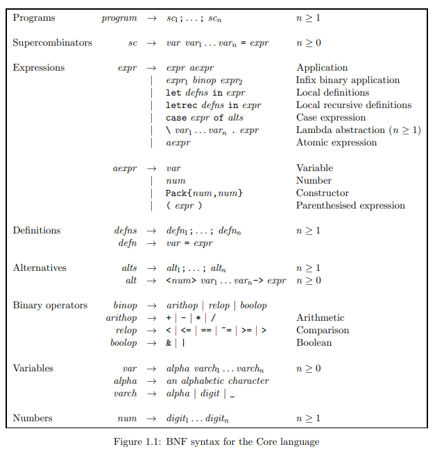

Core Parser
======================

Core Parser is a monadic parser for the Core Language written in Haskell.

This project has been developed for the Functional Languages course at the University of Padova, academic year 2019/2020.
The Core language is defined in the book **Implementing Functional Languages: a tutorial**
of Jones and Lester.

## Data Type

The data type of Core-language expression, *expr*, is defined as follows:

```haskell
data Expr a
  = EVar Name                   -- Variables
  | ENum Int                    -- Numbers
  | AConstr Int Int             -- Constructor tag arity
  | EAp (Expr a) (Expr a)       -- Applications
  | ELet                        -- Let(rec) expressions
      IsRec                       -- boolean with True = recursive
      [Def a]                     -- Definitions
      (Expr a)                    -- Body of let(rec)
  | ECase                       -- Case expression
      (Expr a)                    -- Expression to scrutinise
      [Alter a]                   -- Alternatives
  | ELam [a] (Expr a)           -- Lambda abstractions
  deriving (Show, Eq)
```

## BNF Grammar

The Core Language is defined by the following Backus-Naur Form:



## Operators Associativity

The language's operators use the associativity rules defined in the following table:

| Precedence | Associativity | Operator               |
| ---------- | ------------- | ---------------------- |
| `6`        | `Left`        | `Application`          |
| `5`        | `Right`       | `*`                    |
|            | `None`        | `/`                    |
| `4`        | `Right`       | `+`                    |
|            | `None`        | `-`                    |
| `3`        | `None`        | `==, ~=, >, >=, <, <=` |
| `2`        | `Right`       | `&`                    |
| `1`        | `Right`       | `|`                    |
